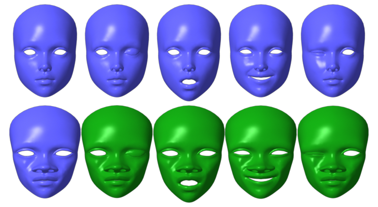

Deformation-Transfer
====================

Transfer deformations from source mesh to target mesh, keeping the identity of target intact. 
Based on the Deformation Transfer algorithm by Sumner: http://people.csail.mit.edu/sumner/research/deftransfer/

Source code provides implementation for deformation transfer and a user friendly Maya command plugin.

To build the Maya plugin binary, the following is required:
Eigen Library, http://eigen.tuxfamily.org
Maya SDK.

Once the plugin is built and installed, the following commands can be executed from within Maya:
defTransfer -src "s00,s01,s02,s03,s04,s05,s06" -tgt "t00,t01,t02,t03,t04,t05,t06";
This will transfer deformation between mesh s00 and s01, s02, s03 ... will be transferred onto mesh t00 and result saved in mesh t01, t02, t03 ...

defTransfer -h
This will display help on how to use the command.

Source and target meshes need to have vertex wise correspondence. Vertex-wise correspondence can be achieved using a non-rigid registration step as described in: 
Expression transfer: A system to build 3D blend shapes for facial animation
http://ieeexplore.ieee.org/xpl/articleDetails.jsp?tp=&arnumber=6727008

More information can be found here:
http://galular.com/chandan.pawaskar/index_files/Page545.htm